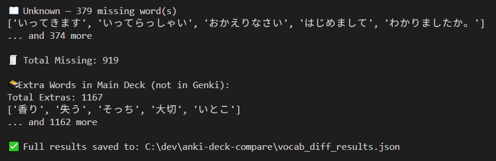

# Anki Genki Vocabulary Coverage Checker

This Python script compares your **Main** Anki vocabulary deck to the **Genki** textbook decks to assess coverage of Genki vocabulary. It identifies:

- 🟢 **Covered words** (Genki vocab found in your main deck)
- 🔴 **Missing words** (Genki vocab not in your main deck, grouped by lesson)
- 🟡 **Extra words** (vocab in your main deck that does not appear in Genki)

Example output:




## 🔍 Features

- Organizes missing vocabulary by **Genki lesson**
- Matches both **kanji** and **kana** (Word and Reading fields)
- Ignores **suspended notes**
- Generates a concise **summary** in the terminal and a detailed **full report** file

## 📂 Deck Format Requirements

- **Main deck** notes must have these fields:
  - `Word` (e.g. 有名)
  - `Word Reading` (e.g. ゆうめい)
- **Genki deck** notes must have:
  - `Question` (e.g. `<ruby>有名<rt>ゆうめい(な)</rt></ruby>` or `いつも`)
  - `Answer` (e.g. `famous [...]`)
  - Belong to a subdeck named like `Genki 1::Lesson 08` or similar

## ▶️ Usage

1. Export both decks to `.apkg` format from Anki.
2. Add the paths to the `.apkg` files in the main method.
3. Run the script:

```bash
python compare_genki_vocab.py
```

4. See summary in the terminal or open the full report file `out/vocab_diff_results.json` in a text editor.

## Future plans

- Handles minor spelling differences (e.g. "な" adjectives)
- fuzzy matching heuristics
- Grouping extras by reading or kanji
- CLI flags (e.g. `--ignore-suspended`, `--min-lesson`)
